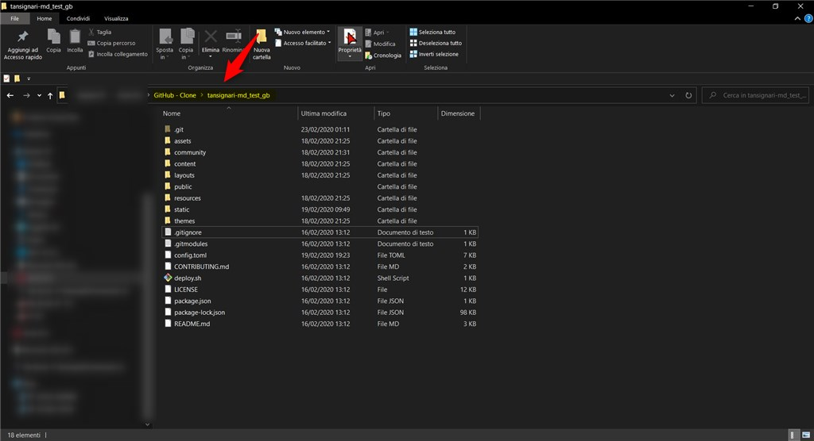
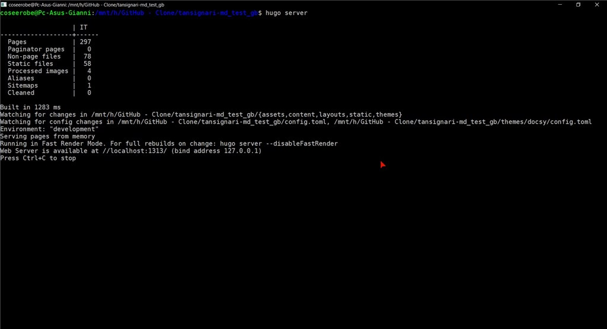

---

## HUGO Server che cos’è?
È un programma, è disponibile praticamente per qualsiasi [piattaforma](https://github.com/gohugoio/hugo/releases/tag/v0.65.2),  in questa ricetta verrà spiegato passo dopo passo come installarlo su nel [bash di Windows](https://www.howtogeek.com/249966/how-to-install-and-use-the-linux-bash-shell-on-windows-10/), ma se desiderate installarlo direttamente su [Windows](https://www.youtube.com/watch?v=G7umPCU-8xc) o e [Mac OS](https://www.youtube.com/watch?v=WvhCGlLcrF8) ci sono molte guide in inglese online,

## Come installare Hugo Server, Linux Bash Shell di Windows 10 con distribuzione Pengwin

- dal repository [hugo](https://github.com/gohugoio/hugo), [releases ](https://github.com/gohugoio/hugo/releases), copiare il link : https://github.com/gohugoio/hugo/releases/download/v0.65.2/hugo_extended_0.65.2_Linux-64bit.tar.gz
- lanciare la shell di Linux da una nuova cartella:
`wget https://github.com/gohugoio/hugo/releases/download/v0.65.2/hugo_extended_0.65.2_Linux-64bit.tar.gz`
- dopo il download, lanciare: ` tar -xzf hugo_extended_0.65.2_Linux-64bit.tar.gz`
- dopo aver unzippato, lanciare per verifica la tua installazione: `which jq` per capire in che cartella spostare il programma `hugo`
- spostare il file, lanciare : ` sudo cp ./hugo /usr/bin/`
- inserire la password di amiministratore: `********`
- dare i permessi, lanciare: `sudo chmod +x ./hugo`
- cambiare cartella, ad esempio `cd ~`
- verificare installazione di `hugo`, lanciare : `hugo version`
- lanciare il server: aprire la bash Shell nella cartella che ospita il repository locale di github e scrivre `hugo server` dopo qualche secondo il sito web viene cotruito.

Adesso non resta che digitare `bash` nella bara degli indirizzi di esplora risorse e si aprirà la Linux Bash Shell di Windows 10 nella cartella del repo

- lanciare il server: `hugo server`

- visualizzare il sito sul web browser: `http://localhost:1313/` 

**Aggiornare Hugo** è facile come scaricare e sostituire l'eseguibile che hai inserito nel **PERCORSO** 

## Pengwin

[Pengwin](https://www.html.it/12/04/2019/pengwin-1-2-porta-gli-sviluppatori-sul-windows-subsystem-for-linux/) è distribuzione Linux sviluppata appositamente per funzionare in Windows 10 WSL (Windows Subsystem for Linux)

---
## Come installare Hugo Server, Linux Bash Shell di Windows 10 con distribuzione Debian o Ubuntu

Con Debian e Ubuntu l'installazione è più semplice, il Debian Go Packaging Team mantengono un pacchetto Debian hugo ufficiale che è condiviso con Ubuntu ed è installabile tramite **apt-get**:

`sudo apt-get install hugo`

In alternativa si può installere scaricando l'ultimo pacchetto **.deb** da [Hugo Github Respo](https://github.com/gohugoio/hugo/releases)

- scarica l'ultima versione tramite il metodo wget ` wget https://github.com/gohugoio/hugo/releases/download/v0.66.0/hugo_extended_0.66.0_Linux-64bit.deb`
- estrarre il pacchetto hugo_extended_0.66.0_Linux-64bit.deb scaricato `sudo dpkg -i hugo_extended_0.66.0_Linux-64bit.deb`
- rimuovi il pacchetto scaricato `rm hugo_extended_0.66.0_Linux-64bit.deb`
- verifica la tua installazione `which hugo` e dopo `hugo version`

**Per disinstallare Hugo su Ubuntu e Debian** `sudo apt-get remove --auto-remove hugo`

## Riferimenti utili

- [Install Hugo](https://gohugo.io/getting-started/installing/)