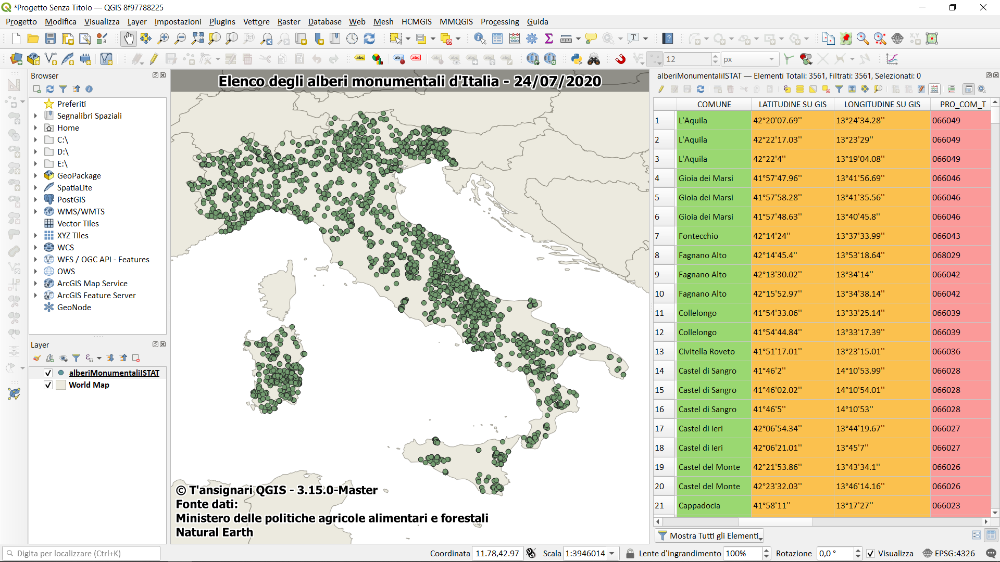

---

L' elenco degli alberi monumentali d'Italia ai sensi della Legge n. 10/2013 e del Decreto 23 ottobre 2014 è stato _aggiornato al 24-07-2020_, in questa ricetta vedremo come scaricare i file `*.xls` presenti nel [sito](https://www.politicheagricole.it/flex/cm/pages/ServeBLOB.php/L/IT/IDPagina/11260) del **Ministero delle politiche agricole alimentari e forestali** e creeremo un unico file CSV.

Le difficoltà sono legati alla presenza di 21 file (da scaricare) in formato `xls`, uno per ogni regione e le Province Autonoma; le coordinate (DMS) hanno uno spazio che li rende inutilizzabili e la virgola al posto del punto decimale; per risolvere tutti questi problemi abbiamo realizzato il seguente script bash che crea un unico file CSV pronto all'uso.

## Script bash

```bash
#!/bin/bash

### requisiti ###
# miller https://github.com/johnkerl/miller
# scrape https://github.com/aborruso/scrape-cli
# pyexcel-cli https://github.com/pyexcel/pyexcel-cli
# pyexcel-xls https://github.com/pyexcel/pyexcel-xls
# yq https://github.com/kislyuk/yq
# parallel https://www.gnu.org/software/parallel/
# ogr2ogr https://gdal.org/programs/ogr2ogr.html
### requisiti ###

set -x

folder="$(cd "$(dirname "${BASH_SOURCE[0]}")" && pwd)"

mkdir -p ./rawdata
mkdir -p ./processing

# cancella file xls
rm -r "$folder"/rawdata/*
rm -r "$folder"/processing/*

# scarica i file xls
curl "https://www.politicheagricole.it/flex/cm/pages/ServeBLOB.php/L/IT/IDPagina/11260" |
  # estrai dati sui file XLS degli alberi
  scrape -be ".blob-element-download .viewLinkIMG" |
  # estrai proprietà href e text (URL e nome file)
  xq -r '.html.body.a[]|[."@href",."#text"]|@tsv' |
  # fai partire il download
  parallel --colsep '\t' wget {1} -O ./rawdata/{2}.xls

for i in "$folder"/rawdata/*.xls; do
  #crea una variabile da usare per estrarre nome e estensione
  filename=$(basename "$i")
  #estrai estensione
  extension="${filename##*.}"
  #estrai nome file
  filename="${filename%.*}"
  # converti file XLS in CSV
  pyexcel transcode --sheet-index 0 "$i" "$folder"/processing/"$filename".csv
done

# unisci i file, tenendo conto di eventuali campi in più e fai pulizia di eventuali spazi bianchi in più
mlr --csv unsparsify then clean-whitespace "$folder"/processing/*.csv >"$folder"/alberi.csv

# dalle coordinate rimuovi spazi e sostituisci "," con "."
mlr -I --csv put '${LATITUDINE SU GIS}=gsub(${LATITUDINE SU GIS}," ","");${LONGITUDINE SU GIS}=gsub(${LONGITUDINE SU GIS}," ","");${LATITUDINE SU GIS}=gsub(${LATITUDINE SU GIS},",",".");${LONGITUDINE SU GIS}=gsub(${LONGITUDINE SU GIS},",",".")' "$folder"/alberi.csv

# scarica limiti comunali
curl -Lk "http://www.istat.it/storage/cartografia/confini_amministrativi/non_generalizzati/Limiti01012020.zip" >"$folder"/rawdata/Limiti01012020.zip

# unzippa i limiti comunali
cd "$folder"/rawdata
unzip ./Limiti01012020.zip

# riproietta limiti da EPSG 32632  a EPSG 4326
mapshaper "$folder"/rawdata/Limiti01012020/Com01012020/Com01012020_WGS84.shp -proj wgs84 -o "$folder"/processing/comuni.shp

# crea colonne coordinate in formato 13d25'25
mlr --csv put '$lat_dd=sub(${LATITUDINE SU GIS},"^([0-9]+)[^0-9]+([0-9]+)[^0-9]+([0-9]+\.?[0-9]*)[^0-9]*","\1d\2'\''\3");$lon_dd=sub(${LONGITUDINE SU GIS},"^([0-9]+)[^0-9]+([0-9]+)[^0-9]+([0-9]+\.?[0-9]*)[^0-9]*","\1d\2'\''\3")' "$folder"/alberi.csv >"$folder"/processing/alberi.csv

# estrai un file con le sole due colonne create sopra
mlr --csv cut -f "lat_dd","lon_dd" "$folder"/processing/alberi.csv >"$folder"/processing/albLL.csv

# converti il file in un CSV separato da spazi senza intestazione
mlr --c2n cat "$folder"/processing/albLL.csv >"$folder"/processing/albLL.txt

# converti le coordinate del file albLL.txt da DDMMSS a decimal degrees
cs2cs -f '%.6f' +proj=latlong +datum=WGS84 +to +proj=latlong +datum=WGS84 "$folder"/processing/albLL.txt | tr " " "\t" >"$folder"/processing/albLLdd

# converti in CSV e aggiungi intestazione al file con le coordinate in decimal degrees
mlr -I --implicit-csv-header --t2c label y,x,z then cut -x -f z "$folder"/processing/albLLdd

# aggiungi campo ID al file con le coordinate in decimal degrees
mlr -I --csv cat -N id "$folder"/processing/albLLdd

# aggiungi campo ID al file degli alberi
mlr -I --csv cat -N id "$folder"/processing/alberi.csv

# aggiungi al file degli alberi le coordinate in decimal degrees
mlr --csv join -j id -f "$folder"/processing/alberi.csv then cut -x -f "lat_dd","lon_dd" "$folder"/processing/albLLdd >"$folder"/alberi.csv

# crea file geojson
ogr2ogr -f geojson alberi.geojson alberi.csv -oo X_POSSIBLE_NAMES=x -oo Y_POSSIBLE_NAMES=y

# aggiungi codice ISTAT
mapshaper alberi.geojson -join ./processing/comuni.shp fields=PRO_COM_T -o alberiMonumentaliISTAT.csv
```

## Visualizzazione



## Dati

1. file **CSV** (UTF-8, delimitatore=",") (su gdrive): [visualizza/scarica](https://docs.google.com/spreadsheets/d/1Hfmpm6yO8Ma7EfFVQSo4GAReXZAFaSlgKeeROvIEcRw/edit?usp=sharing)
2. file **geojson** (gist) : [visualizza/scarica](https://gist.github.com/pigreco/c9e5680d7db7e6e7c405f73dce2c3c47)
3. file **CSV** zippato : [scarica](https://gist.github.com/pigreco/e0f38a1cf6bd90b6f8258f01fda828cc/archive/d3957ba4855a729370db6117e7e5d634cf1832fe.zip)

## Riferimenti

- **cs2cs_dms2dd** : <https://gist.github.com/aborruso/d164b9568b725b3ae99faeccff204bce>